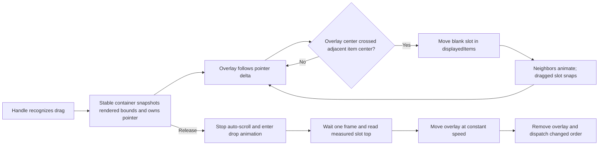

# `RoutineReorderableLazyColumn` Maintenance Guide

This document is the source of truth for the shared vertical reorder interaction in
RoutineHelper. Read it before changing the list structure, drag gestures, placement animation,
auto-scroll, drop animation, or the way reordered data is persisted.

The component lives in `:core:ui` because it is shared UI infrastructure with no Current List,
Daily, or Weekly business knowledge. Its current consumers are:

- [Current List](../features/current-list/src/main/kotlin/com/robertgasparian/routinehelper/ui/currentlist/CurrentListScreen.kt),
  using whole-card long-press recognition, a trailing item overflow action, and a sticky bulk-actions
  header.
- [Daily and Weekly tracking](../features/routine-tracking/src/main/kotlin/com/robertgasparian/routinehelper/ui/tracking/RoutineTrackingComponent.kt),
  using long-press drag recognition, reveal-and-tap deletion, and a summary-note header.

The most important invariant is:

> The dragged card follows the finger independently of LazyColumn item placement. Reordering moves
> a blank slot and the neighboring items; it must never move or compensate the dragged card.

## File map

| File | Responsibility |
| --- | --- |
| [`RoutineReorderableLazyColumn.kt`](../core/ui/src/main/java/com/robertgasparian/routinehelper/ui/dsm/RoutineReorderableLazyColumn.kt) | Public API, LazyColumn content, dragged overlay, blank slot, and rendered item/slot measurement. |
| [`RoutineReorderGesture.kt`](../core/ui/src/main/java/com/robertgasparian/routinehelper/ui/dsm/RoutineReorderGesture.kt) | Handle recognition and stable container-level pointer ownership. |
| [`RoutineReorderState.kt`](../core/ui/src/main/java/com/robertgasparian/routinehelper/ui/dsm/RoutineReorderState.kt) | Optimistic order, drag coordinates, lifecycle, and source reconciliation. |
| [`RoutineReorderGeometry.kt`](../core/ui/src/main/java/com/robertgasparian/routinehelper/ui/dsm/RoutineReorderGeometry.kt) | Directional adjacent-item threshold calculation. |
| [`RoutineReorderAutoScroller.kt`](../core/ui/src/main/java/com/robertgasparian/routinehelper/ui/dsm/RoutineReorderAutoScroller.kt) | Continuous edge auto-scroll owned by the drag. |
| [`RoutineReorderDropAnimation.kt`](../core/ui/src/main/java/com/robertgasparian/routinehelper/ui/dsm/RoutineReorderDropAnimation.kt) | Constant-speed travel from the finger position to the measured slot. |
| [`RoutineSwipeToReveal.kt`](../core/ui/src/main/java/com/robertgasparian/routinehelper/ui/dsm/RoutineSwipeToReveal.kt) | Reusable horizontal covered/revealed interaction composed around Current List and tracking cards; it does not participate in vertical reorder state. |
| [`RoutineSwipeToDismiss.kt`](../core/ui/src/main/java/com/robertgasparian/routinehelper/ui/dsm/RoutineSwipeToDismiss.kt) | Preserved full end-to-start Material swipe-dismiss alternative; it is not used by the active lists. |

Pure state, geometry, auto-scroll, duration, and coordinate-conversion behavior is covered by the
corresponding `RoutineReorder*Test.kt` files under `core/ui/src/test`. Swipe direction and exit
geometry have focused `RoutineSwipeToRevealTest` coverage, while covered and revealed layouts have
Paparazzi test definitions in the same module.

## Public API contract

Typical usage looks like this:

```kotlin
RoutineReorderableLazyColumn(
    items = uiState.items,
    itemId = ItemUiState::id,
    state = listState,
    contentPadding = contentPadding,
    itemSpacing = 12.dp,
    dragStartMode = RoutineReorderDragStartMode.Immediate,
    onOrderChange = { orderedIds -> onIntent(ReorderItems(orderedIds)) },
) { item ->
    ItemCard(
        item = item,
        dragHandleModifier = dragHandleModifier,
        isDragHandleActive = isDragHandleActive,
    )
}
```

The caller must honor these rules:

- `itemId` must return a unique, stable `Long`. Identity must not depend on the current index,
  visible content, or mutable presentation state.
- Apply `dragHandleModifier` to the exact UI region that should start a reorder gesture. Do not put
  a second reorder detector on the card or row. Current List applies it to the full card; tracking
  applies it to its existing drag interaction region.
- `itemContent` must tolerate being moved from the LazyColumn item into the overlay composition
  during a drag. Important interaction state should be hoisted; do not rely on local composable
  state surviving that transition.
- `isDragHandleActive` covers pointer-down feedback as well as an active drag. `isDragging` begins
  only after drag recognition.
- `header` and `footer` are never reorderable. `stickyHeader` affects only the optional header.
- `onOrderChange` is called after the drop travel completes, and only when the order changed. The
  caller owns persistence and must eventually publish the accepted order back through `items`.
- Persistence rejection and rollback are not modeled. See [Source reconciliation and
  persistence](#source-reconciliation-and-persistence).

The component owns interaction mechanics. Feature code owns the item UI, the persistence intent,
and business rules about whether reordering is allowed.

## Visual model

During a drag there are two representations of the selected item:

1. A fixed-height blank slot inside the LazyColumn. It participates in logical order and gives the
   neighboring items somewhere to move around.
2. An overlay card rendered after the LazyColumn. It follows the finger and therefore draws above
   every list item without `zIndex` or elevation.

The real card is not translated inside the LazyColumn. This separation is what keeps the finger
anchor stable when `displayedItems` changes order.



The overlay currently has no elevation animation or graphics layer. It is on top because it is the
last child of the component's root `Box`. Elevation is a visual option, not a positioning tool, and
must not be used to repair a bad handoff.

Current List provides drag activation feedback without changing geometry. Its card animates from
`surfaceContainerLow` to `surfaceContainerHigh` while its border animates from `outlineVariant` to
`primary`. Both colors are driven by one progress animation, so they remain synchronized. This
follows Material's distinction between effects motion, such as color, and spatial motion that
changes shape or bounds. The project uses Material 3's standard `MotionScheme` because reordering is
a recurring utility interaction, and the activation transition uses the theme's `fastEffectsSpec`.
Keep the timing theme-driven instead of adding a local duration or easing curve.

The trailing overflow icon replaces the former dedicated drag icon. A tap opens item actions, while
the card's shared modifier recognizes a long press for reordering. The expanded item-menu ID is
hoisted in `CurrentListComponent`; do not make menu ownership depend on card-local composition
because `itemContent` moves between the Lazy item and overlay during a drag.

## Reorderable-list horizontal swipe-to-reveal

Current List, Daily, and Weekly compose each card inside `RoutineSwipeToReveal`. This is a separate
horizontal interaction built with Foundation `AnchoredDraggableState`; it deliberately does not add
horizontal logic to `RoutineReorderableLazyColumn`.

The component has exactly two user-reachable anchors:

- `Covered` at zero.
- `Revealed` at `80.dp` toward the logical start edge, exposing one trailing action.

There is no dismissed anchor, so a swipe or a high-velocity fling can reveal the delete action but
can never delete an item. Deletion requires a click on the exposed Material error-container action.
After that click, the component immediately dispatches the caller's removal intent. It does not
animate the foreground off screen. The containing Lazy item's `animateItem()` disappearance and
neighbor movement are the single delete animation, avoiding consecutive or competing visual
phases. Anchored settling still uses the theme's fast spatial motion spec. RTL layouts reverse the
reveal offset while preserving the same end-to-start interaction.

The API is controlled: `CurrentListComponent` and the shared `RoutineTrackingComponent` each own
one `revealedItemId`, pass `isRevealed`, and update that ID through `onRevealedChange`. This keeps at
most one row open per list. Starting vertical list scroll clears the ID, opening a Current List
row's overflow menu closes its swipe action, and starting reorder disables/closes the horizontal
interaction. The long-press modifier remains attached while a row is revealed. Pointer-down sets
`isDragHandleActive`, which begins covering the row during the long-press timeout; once recognition
completes, reorder starts from the covered representation.

The error-container underlay fills the complete item bounds and uses the same rounded shape as the
card. Only the trailing `80.dp` action region is clickable. Keeping the visual underlay independent
of the action width prevents the card's rounded trailing corners from exposing list background at
the reveal seam, and it stays correct if the reveal width changes later. The whole underlay layer is
drawn only while the foreground offset is away from the covered anchor; this prevents red
anti-aliasing from bleeding through the card's outer rounded corners while idle.

The hidden action has its semantics cleared while covered. Keep this behavior if the action UI is
changed; a visually covered delete button must not remain focusable to accessibility services.
The exposed bin remains a semantic button but intentionally uses no click indication, so tapping it
does not draw a ripple over the error-container action.

`onAction` is invoked immediately after the action is accepted and guarded against a second click.
It is expected to remove the containing item. If deletion later gains a recoverable failure path,
extend this contract with an explicit outcome and reset behavior. Do not add a timer that restores
the revealed row while persistence may still be in flight.

Do not replace the anchored horizontal gesture with raw pointer interception. Foundation's
orientation-aware drag arbitration is what lets ordinary vertical list scroll win before the
long-press reorder timeout while preserving horizontal reveal.

While the overlay exists—including during drop travel—its item scope reports
`isDragHandleActive = true` and `isDragging = true`. Its `dragHandleModifier` is empty, so the
overlay cannot start a second detector. Treat these booleans as visual interaction state, not as a
signal to run business logic.

Every Current List, Daily, and Weekly row uses this reveal-and-tap interaction. All three route the
action into the global durable removal workflow described in
[`removal-undo.md`](removal-undo.md). Only one source can own the undo window at a time; same-source
removals batch and reset the timer, while other-source reveal gestures are disabled. Daily and
Weekly keep the routine item, owning action, tracking entries, and persisted list slot until the
user undoes the removal or the timeout performs the final delete. History remains a separate
selection-based deletion workflow.

### Preserved full-swipe alternative

`RoutineSwipeToDismiss` keeps the former Material 3 `SwipeToDismissBox` behavior available as a
reusable DSM alternative. It supports only end-to-start dismissal, resets its visual state, and
then asks the caller to remove the item. It is intentionally not used by an active list.

Material dismissal considers both position and fling velocity. A short, fast horizontal movement
can therefore dismiss even when it did not travel far, which is the failure mode that motivated
the active reveal-and-tap design. Use the full-dismiss alternative only when swipe itself is an
acceptable confirmation, and keep `RoutineSwipeToReveal` for destructive actions that require an
explicit action-button tap.

## Effective lifecycle

The user-visible lifecycle is:

1. **Idle:** `displayedItems` follows the source list.
2. **Handle pressed:** pressed feedback is exposed, but no item is moving yet.
3. **Dragging:** the selected card is an overlay, the container owns the pointer, auto-scroll runs,
   and `displayedItems` changes optimistically as thresholds are crossed.
4. **Drop animating:** pointer ownership and auto-scroll end. New drags are blocked while the
   overlay travels to its measured slot.
5. **Awaiting source confirmation:** the overlay is gone and the optimistic order remains visible
   while the caller persists it.
6. **Idle again:** the source publishes the accepted order.

`RoutineReorderPhase` models Idle, Dragging, and AwaitingSourceConfirmation. `isDropAnimating` is a
separate flag because the private reconciliation phase remains Dragging until the visual drop has
finished.

Cancellation clears the active drag, restores the latest source order, and stops auto-scroll.
Cancellation after the user has released but before the drop effect completes also means the order
callback is not dispatched. The current animation is short, but this is relevant if a future UI can
navigate away during a drop.

## Gesture ownership

Gesture handling is deliberately split between the handle and the list container.

### Handle responsibilities

`reorderDragHandle`:

- Tracks pointer-down/up so item UI can show pressed feedback.
- Selects immediate recognition or long-press recognition. Immediate means vertical drag after
  normal touch slop, not on the initial down event; this allows a tap or horizontal interaction to
  remain distinguishable.
- Calls `onDragStart` once the configured gesture is recognized.
- Temporarily forwards drag deltas before the container has observed the new drag.
- Continues consuming its pointer changes, but stops mutating the drag position after container
  ownership is active.

There can be a small timing gap between the handle recognizing a drag and the container observing
`draggedItemId`. Deltas received in that gap are stored in `dragDeltaBeforeContainer` and applied to
the initial overlay position. Removing that accumulator can make the card jump behind the finger at
drag start.

### Container responsibilities

`reorderDragContainer` is attached to the stable LazyColumn, not to a Lazy item. It:

- Observes the original pointer at `PointerEventPass.Initial` with `requireUnconsumed = false`.
- Locks the gesture to the pointer ID and dragged item that started it.
- Verifies the item is visible through `LazyListState.layoutInfo`, then captures its actual rendered
  top and size from the component's continuously measured item bounds.
- Applies all later pointer deltas exactly once.
- Evaluates reorder thresholds after finger motion and after auto-scroll motion.
- Starts and stops the one auto-scroll job for the gesture.
- Starts the drop animation on pointer-up.
- Restores source order if the gesture is cancelled before a valid drop begins.

This stable owner fixed the case where dragging above the list into the app bar caused the item-level
gesture to stop and drop. A Lazy item is a poor lifetime owner: it moves, may be replaced by a
placeholder, and can leave composition during auto-scroll. The app bar and bottom navigation must
not be hidden as a workaround; the gesture must remain owned by the stable container.

`isContainerDragActive` prevents both the handle and container from adding the same delta. The
`finally` block in the container detector is also intentional: it cleans up cancellations, while its
`!isDropAnimating` guard prevents normal pointer-up from undoing a drop that just started.

## Coordinates and measurement

Most subtle reorder bugs have been coordinate bugs. The current coordinate contract is:

| Value | Unit and coordinate space | Used for |
| --- | --- | --- |
| `draggedItemTop` | Pixels relative to the component root/LazyColumn vertical origin | Overlay position, thresholds, and auto-scroll. |
| `draggedItemSize` | Pixels | Placeholder height, overlay center, and bottom edge. |
| Measured item bounds | Actual placed pixels relative to the component root | Initial overlay top and captured item size. |
| `LazyListItemInfo.offset` | Logical pixels relative to the LazyColumn viewport | Neighboring-item geometry only. |
| `draggedItemSlotTop` | Actual placed pixels relative to the component root | Final drop target only. |
| Auto-scroll thresholds and steps | Configured in dp, converted to pixels | Density-correct edge behavior. |

The LazyColumn fills the component root, and the overlay uses the same vertical origin. The overlay
copies only the left and right content padding. Top content padding is already represented by the
measured/laid-out Y position and must not be added again.

Each visible reorderable item's outer box is continuously measured. Both its initial top and the
active slot top use the same conversion:

```text
dragged item positionInRoot().y - component positionInRoot().y
```

`RoutineReorderLayoutCoordinates` keeps the latest bounds keyed by stable item ID. Every placement
refreshes the entry, and `DisposableEffect` removes it when that Lazy item leaves composition. Keep
both halves of this lifecycle: retaining disposed entries can make a later drag start from stale
coordinates, while measuring only the active item is too late to initialize the overlay without a
representation jump.

At drag recognition, the container snapshots the selected card's measured top and size before the
card is replaced by its placeholder. This prevents the activation jump that occurs when a logical
`LazyListItemInfo.offset` differs from the card's actual rendered position due to placement
animation or another layout effect. `visibleItemsInfo` still verifies that the selected item is
currently visible, but it is not the source of the starting coordinate. If either visibility or
measured bounds is unexpectedly unavailable, cancel the drag; do not fall back to a logical offset
and reintroduce the jump.

The shared conversion makes the measured positions directly comparable to `draggedItemTop`, which
drives the overlay's local Y offset.
If a UI overhaul moves the overlay into a popup, another window, or a parent with a different
transform, this coordinate conversion must be redesigned and retested.

`draggedItemSize` is captured once when the container takes ownership. Different items may have
different heights, but the active card's height is assumed to remain stable during that drag. The
placeholder, center threshold, and auto-scroll bottom edge all use the captured size. If a future UI
animates card height or changes text/layout while the card is being dragged, either freeze that
height or explicitly redesign size measurement and all three consumers.

## Reorder threshold and neighbor animation

`calculateReorderMove` uses the dragged overlay's center:

```text
dragged center = draggedItemTop + draggedItemSize / 2
```

It compares that center with only the adjacent item's center in the active motion direction:

- Moving up considers `fromIndex - 1` and moves only after crossing above its center.
- Moving down considers `fromIndex + 1` and moves only after crossing below its center.

This is directional and adjacent by design:

- Directional evaluation prevents a tall item from satisfying thresholds on both sides and
  oscillating when the user reverses direction.
- Adjacent-only moves prevent skipping an off-screen item because some farther visible item was
  crossed.
- If the adjacent target is not visible, no move occurs yet. Auto-scroll eventually brings that
  neighbor into `visibleItemsInfo`, after which the next frame can move it.
- Header and footer entries are ignored because geometry accepts only `Long` keys that exist in the
  current item ID set.

When a move occurs, `RoutineReorderState.move` changes only `displayedItems`. It does not modify
`draggedItemTop`. This is the core anti-bounce rule. The overlay remains anchored to the same finger
point while the blank slot and neighboring items rearrange beneath it.

Non-dragged items use the default `Modifier.animateItem()` placement animation. The dragged item's
outer Lazy item keeps an `animateItem` node too, but with fade disabled and a `snap()` placement
spec. Keeping the same outer `Box` is important; only its inner content switches between the real
item and the blank placeholder.

Do not let the dragged placeholder use the normal placement animation. Its measured position would
then continue moving while the overlay was already traveling toward an earlier sample, recreating a
moving-target handoff.

## Auto-scroll

Auto-scroll is one continuous coroutine for the lifetime of the drag. It enters
`listState.scroll(MutatePriority.PreventUserInput)` and evaluates the overlay bounds once per frame.

Current tuning:

- Edge zone: `64.dp` from the viewport top and bottom.
- Maximum step: `12.dp` per frame.
- Speed scales linearly from zero at the inside of the edge zone to the maximum once the overlay
  reaches or passes the edge.

The calculation uses the overlay's top and bottom, not the blank slot. The card can therefore stay
under the finger while the list scrolls beneath it. When scrolling consumes pixels, reorder geometry
is evaluated using the scroll direction even if the finger is stationary.

The continuous exclusive scroll session fixed two related failures:

- Scroll that stopped as soon as the finger stopped producing move events near an edge.
- Competing one-off scroll jobs that could cancel or block one another, especially after dragging a
  tall item to one edge and then reversing toward the other.

Do not launch a new `scrollBy` coroutine for each pointer event. Do not adjust `draggedItemTop` by
the consumed list scroll; the overlay is screen/finger anchored while only list content scrolls.

Two current tuning nuances should be considered during a future overhaul:

- The maximum is per frame, so physical speed depends on display refresh rate. A time-based speed
  calculation would be needed for identical dp/second behavior across 60 Hz and 120 Hz devices.
- If an item is taller than the viewport and overlaps both edge zones, the top branch currently has
  priority. Supporting oversized cards perfectly would require an explicit pointer-direction or
  anchor policy and dedicated tests.

`DisposableEffect` stops the job if the component leaves composition. The container also stops it
on release and cancellation.

## Drop animation and exact handoff

On pointer-up, `onDropAnimationStart` clears pressed feedback, ends container ownership, and sets
`isDropAnimating`. A `LaunchedEffect` then performs the drop.

### Why the target is measured

The first drop implementation used the dragged item's `LazyListItemInfo.offset`. That value is the
logical target placement. During `animateItem`, Compose can render an item at:

```text
logical offset + animated placement delta
```

The public `LazyListItemInfo.offset` does not include that internal visual placement delta. The
overlay therefore traveled to a point slightly above the rendered slot and then appeared to
"settle" or jump when the real card took over. Slowing system animations made this mismatch easy to
see.

The current implementation instead measures the actual placed blank slot with
`onGloballyPositioned`. The dragged slot uses snap placement, so the measured target is stable while
the neighboring items may still be animating.

`withFrameNanos { }` before reading the measurement is required. A threshold move and pointer-up can
occur close together; waiting one frame allows the latest `displayedItems` layout and
`onGloballyPositioned` callback to finish. Removing the wait can animate to the previous slot.

The drop target is sampled once after that frame. The design assumes the slot, header, content
padding, and dragged item height remain stable for the short drop travel. If an overhaul introduces
layout or inset animation during drop, freeze that layout or redesign the animation to follow a
carefully measured moving target.

If no measured target is available, the effect skips travel and completes the reorder as a
fail-safe. If this becomes visible in normal use, fix the missing measurement; do not fall back to a
logical list offset without accounting for placement animation.

### Speed and completion

The overlay travels with linear easing at a fixed `800.dp` per second. Duration is derived from
distance:

```text
durationMillis = abs(targetTop - initialTop) / speedPxPerSecond * 1000
```

This replaced a fixed approximately 250 ms duration. A fixed duration looked reasonable for a long
drop but made a nearby drop move unnaturally slowly. Constant speed makes short drops short and long
drops proportionally longer.

At the final animation frame, `draggedItemTop` equals the actual slot top. `onDragEnd` then removes
the overlay/placeholder state. The real card renders at the same coordinate, so there is no second
visual phase. Only after this travel does `onOrderChange` dispatch the new ID order.

The effect's `finally` block resets an unfinished drop if its coroutine is cancelled. New drag
starts are ignored while `isDropAnimating` is true.

## Compose state and performance details

Not every internal value is Compose state. This distinction is intentional.

Compose-observed values include:

- `displayedItems`, because list content/order must recompose.
- `pressedHandleItemId`, because handle styling may change.
- `draggedItemId`, because the real item must switch to a placeholder/overlay.
- `draggedItemTop`, because overlay placement must invalidate.
- `isDropAnimating`, because it starts the drop effect and blocks a new drag.

Plain internal values include item size, measured slot top, container ownership, the pre-container
delta, source items, and reconciliation phase. They are read by gesture/effect code or are updated
alongside an observed state change. Making every per-frame or internal bookkeeping value Compose
state creates unnecessary snapshot invalidation and makes ownership harder to reason about.

`draggedItemTop` is read inside the lambda form of `Modifier.offset`, so position changes invalidate
placement rather than recomposing all item content. `derivedStateOf { draggedItemTop != null }`
exposes only the null/non-null transition to composition; it avoids recomposition for every pixel of
drag or drop movement.

`itemId` and `onOrderChange` are wrapped with `rememberUpdatedState`, while stable wrapper lambdas are
remembered. This lets long-lived gesture/state machinery call the newest caller-provided functions
without recreating them on every recomposition.

## Source reconciliation and persistence

The component keeps two lists:

- `sourceItems`: the latest authoritative list received from the caller.
- `displayedItems`: the optimistic order currently rendered by the component.

`SideEffect` calls `syncFromSource` after successful composition.

| Phase | Source update behavior |
| --- | --- |
| Idle | Replace `displayedItems` with the source. |
| Dragging | Preserve the optimistic ID order, refresh content for surviving IDs, remove missing IDs, and append new IDs. |
| AwaitingSourceConfirmation | Keep the optimistic order until the source contains the expected relative order; continue merging content and membership changes meanwhile. |

Confirmation compares the expected order only among IDs still present. This allows an unrelated
insert or removal to occur while persistence is completing without discarding the user's reorder.

If the final displayed order equals the source order, `onDragEnd` returns no callback. If it differs,
the ID list is returned and the component enters AwaitingSourceConfirmation.

There is deliberately no persistence error channel. If persistence rejects the new order and the
source never publishes it, the optimistic order can remain displayed. A future rejection design
must be explicit—for example, an accepted/rejected result or a source version—not inferred from a
single repeated old list emission. Do not add a timer-based rollback without defining how it
interacts with slow writes and concurrent item changes.

The current persistence path is:

- Current List component -> `CurrentListIntent.ReorderItems` -> ViewModel ->
  `ReorderCurrentListItemsUseCase`.
- Daily component -> `RoutineTrackingIntent.ReorderItems` -> Daily ViewModel ->
  `ReorderDailyRoutineItemsUseCase`.
- Weekly component -> `RoutineTrackingIntent.ReorderItems` -> Weekly ViewModel ->
  `ReorderWeeklyRoutineItemsUseCase`.

## Failed approaches and why they failed

These are not hypothetical warnings. Each approach below produced a real interaction problem during
development.

### Translating the actual Lazy item

The original implementation rendered the dragged card in the list, applied `translationY`, and
adjusted that translation when the list order changed. At each threshold, the Lazy item acquired a
new logical position while the code also compensated its translation. Those two coordinate changes
made the card bounce relative to the finger.

**Do not reintroduce:** offset compensation based on the crossed item's size. The overlay position
must be independent from logical reordering.

### Letting a Lazy item own the full pointer gesture

An item can move, be replaced, or leave composition while the gesture is still active. Dragging
through the app-bar boundary caused the gesture to stop and the item to drop unexpectedly.

**Do not reintroduce:** item-lifetime ownership or hiding the app bar/navigation bar during drag.
Keep recognition on the handle and lifetime ownership on the stable list container.

### Starting auto-scroll only from pointer moves

One-off scroll launches worked while the finger kept moving but could stop at an edge when held
still. Reversing direction after a long scroll also exposed competing scroll mutations.

**Do not reintroduce:** a coroutine launch per drag event. Keep one frame-driven
`PreventUserInput` scroll session and reevaluate reorder after consumed scroll.

### Using one fixed drop duration

A fixed duration made short travel visibly slow while long travel looked acceptable.

**Do not reintroduce:** a universal 200-300 ms duration. Tune the speed constant unless the motion
design intentionally changes to a distance-aware spring or another measured model.

### Animating to `LazyListItemInfo.offset`

The logical offset omitted the active `animateItem` placement delta. The overlay stopped slightly
above the actual card and jumped during handoff.

**Do not reintroduce:** `LazyListItemInfo.offset` as the final drop target. Use the actual placed slot
in the overlay's coordinate space.

### Animating the dragged placeholder

If the placeholder uses the default `animateItem` placement animation, its visual coordinate keeps
changing. A drop target sampled once then becomes stale.

**Do not reintroduce:** normal placement animation on the dragged slot. Keep its stable outer node
and snap placement; animate the neighbors.

### Delaying item modifiers or handoff

A delayed modifier/handoff created two visible phases: the elevated/overlay card arrived, then the
real list item settled separately. It did not solve the incorrect target.

**Do not reintroduce:** delayed overlay removal, delayed `animateItem`, or a second settle state. One
travel should end at the actual slot, followed by immediate representation handoff.

### Running an off-screen swipe after requesting removal

An action-owned `Animatable` briefly moved the foreground while removal simultaneously removed the
keyed Lazy item. The item composition was then disposed and its `rememberCoroutineScope` cancelled.
`animateItem()` retained only the last rendered graphics layer for disappearance, not the live
swipe composition, so the horizontal motion froze after a small step while the list kept closing.

**Do not reintroduce:** an item-owned exit coroutine that must outlive removal. Either let the Lazy
item own the complete delete animation, as the current design does, or build a separately owned
list-level overlay if a future design truly requires motion after source removal.

### Treating elevation as the cause or cure

Lowering and then removing elevation made the extra phase easier to diagnose but did not remove the
position mismatch. Elevation and `zIndex` cannot correct coordinate math. `zIndex` inside a
LazyColumn also does not provide reliable ordering against UI outside that parent.

**Do not reintroduce:** elevation animation as a handoff mechanism. If a future design wants a
shadow, apply it only to the overlay, animate it concurrently with the one position travel, and test
the handoff with slowed system animations.

## Safe extension points

### Change neighboring-item motion

Customize only the non-dragged `Modifier.animateItem()` spec. Keep the dragged item's placement spec
as `snap()` unless the drop animation is redesigned to follow a continuously moving target.

### Change drop feel

Tune `DraggedItemDropSpeedDpPerSecond` first. If changing easing, remember that duration is currently
derived from constant speed; a non-linear easing no longer produces constant instantaneous speed.
Test both very short and long drops.

### Change reorder sensitivity

Change the pure center-threshold policy in `RoutineReorderGeometry.kt` and add tests for upward,
downward, variable-height, reversal, and off-screen-adjacent cases. Do not put threshold logic back
inside pointer handling.

### Change auto-scroll feel

Change the dp edge/step values or replace the pure delta function with a time-based model. Preserve
the single scroll session, overlay-bound calculation, and reorder callback after consumed scroll.

### Add elevation or drag visuals

Render them on the overlay. Keep the overlay as the last root child and do not make visual state
control when the overlay is removed. Verify at slow animator scales.

For feature-owned card feedback, prefer effects that do not alter measured geometry. Current List
uses synchronized container and border color animation from `isDragging`. Avoid padding and size
changes because item size is captured once at drag start; avoid scale unless its center-origin edge
movement is an intentional part of the motion design.

### Add horizontal or grid reordering

The current implementation is intentionally vertical and LazyColumn-specific. Orientation,
coordinates, thresholds, auto-scroll axes, and placement measurement are coupled. Build a separate
generalized geometry/gesture design rather than adding scattered orientation flags.

## Current limitations

- IDs are `Long`, not a generic key type.
- Only vertical LazyColumn reordering is supported.
- Persistence rejection/rollback is not modeled.
- Drag state is remembered, not saveable across recreation.
- Accessibility reorder actions, keyboard reordering, and haptics are not implemented.
- The pure logic is tested, but there is no automated end-to-end pointer/animation test for app-bar
  crossing and representation handoff.
- Removing the actively dragged item from the source is not a polished interaction; membership
  reconciliation removes it, but there is no dedicated user-facing cancellation behavior.
- Very tall items that overlap both auto-scroll edge zones use top-edge priority.
- Auto-scroll maximum speed is per frame rather than elapsed-time based.
- The initial rendered bounds and final drop target are snapshots; dynamic height or inset changes
  during one active drag/drop are not followed continuously.

Treat these as explicit future work, not reasons to weaken the invariants that already work.

## UI overhaul checklist

Before changing the component:

- Read this guide and the eight production files in the file map.
- Keep stable, unique item IDs.
- Keep the overlay/blank-slot split.
- Keep pointer lifetime ownership on the stable container.
- Keep `draggedItemTop` independent from logical order changes and list scroll.
- Keep the dragged Lazy item's outer node stable.
- Keep dragged-slot placement snapped while neighbors animate.
- Initialize the overlay from the card's measured rendered bounds, never a logical LazyList offset.
- Keep the final drop target measured in the same coordinate space as the overlay.
- Keep the one-frame wait before sampling the final slot.
- Decide explicitly whether persistence still happens after the visual drop or at pointer-up.
- Define a real rejection contract before adding rollback.

Manual regression matrix:

- In a debug build, use **Add test items** from the overflow menu on Current List, Daily, and
  Weekly. Verify every selection appends another 20 items even when the list is already populated,
  and that the generated numbering continues from the current visible item count.
- Current List whole-card long-press drag and Daily/Weekly long-press drag.
- Tap the Current List checkbox and trailing overflow icon without starting a drag; verify Edit opens
  the shared item dialog with the current title and description prefilled.
- Current List horizontal swipe-to-reveal before the long-press timeout, including starting the
  swipe from the card body. Verify it stops at the action and never deletes by swipe alone.
- Reveal one Current List action, reveal another, and verify only the second stays open.
- Reveal an action, vertically scroll the list, and verify the row closes without deleting.
- Reveal an action, tap its bin, and verify there is no second off-screen swipe: the Lazy item closes
  its gap smoothly while the existing remove/undo flow begins.
- Reveal an action, long-press the card, and verify it covers during the timeout before reorder
  starts without a horizontal jump.
- Repeat reveal, single-open-row, vertical-scroll close, bin-tap exit, and reorder-handoff checks on
  both Daily and Weekly. Verify the correct source-aware undo snackbar appears and temporary hide
  remains a separate item action.
- With one source's undo snackbar visible, switch tabs and verify other-source delete gestures are
  disabled while same-source removals still join the active batch.
- Long-press a card immediately after list placement motion and verify activation has no vertical
  jump relative to the finger.
- Drag upward through the app-bar boundary and hold there.
- Drag downward into the bottom edge/navigation area and hold there.
- Move the same item down, back up, and down again during one gesture.
- Move a tall, long-description item from bottom to top and then back toward the bottom.
- Drop very close to the slot and far away from the slot.
- Start a drag but release without changing order.
- Reorder with sticky and non-sticky headers.
- Reorder while item content or list membership updates from the source.
- Repeat handoff inspection with Developer Options animator duration scale slowed substantially.
- Test at 60 Hz and a high-refresh-rate mode when changing auto-scroll tuning.

Run at least:

```text
.\gradlew.bat :core:ui:testDebugUnitTest :features:current-list:testDebugUnitTest :features:routine-tracking:testDebugUnitTest :core:ui:lintDebug :app:assembleDebug
```

Do not update Paparazzi baselines unless the UI overhaul intentionally changes approved visuals.

## Short version: invariants not to break

1. The overlay follows the finger; reordering never compensates its position.
2. The stable container owns the pointer for the entire gesture.
3. Only the adjacent item in the current direction can be crossed.
4. Auto-scroll is one continuous, exclusive, frame-driven session.
5. Neighbors animate; the dragged blank slot snaps.
6. Both drag start and drop handoff use actual measured positions, never logical LazyList offsets.
7. Drop duration is distance-derived, and handoff happens once at the exact final coordinate.
8. The optimistic order remains until the source confirms it; rejection requires an explicit design.
